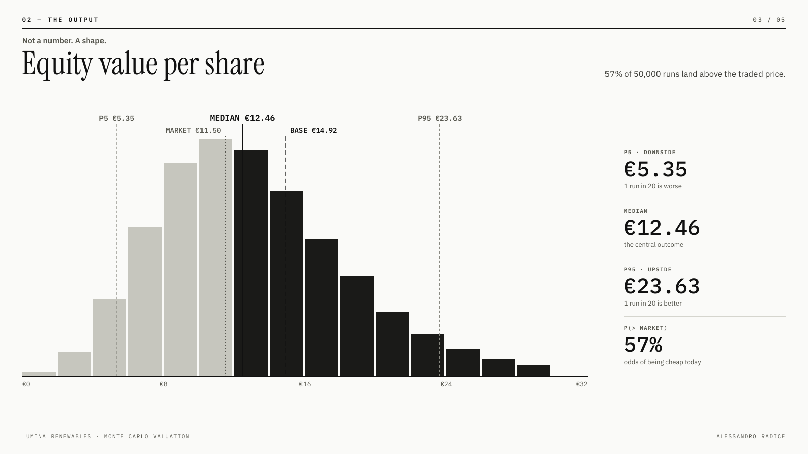
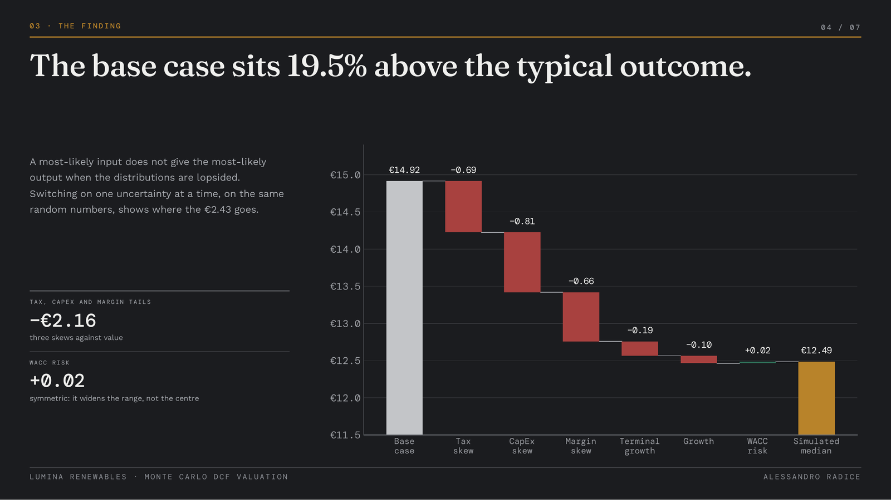
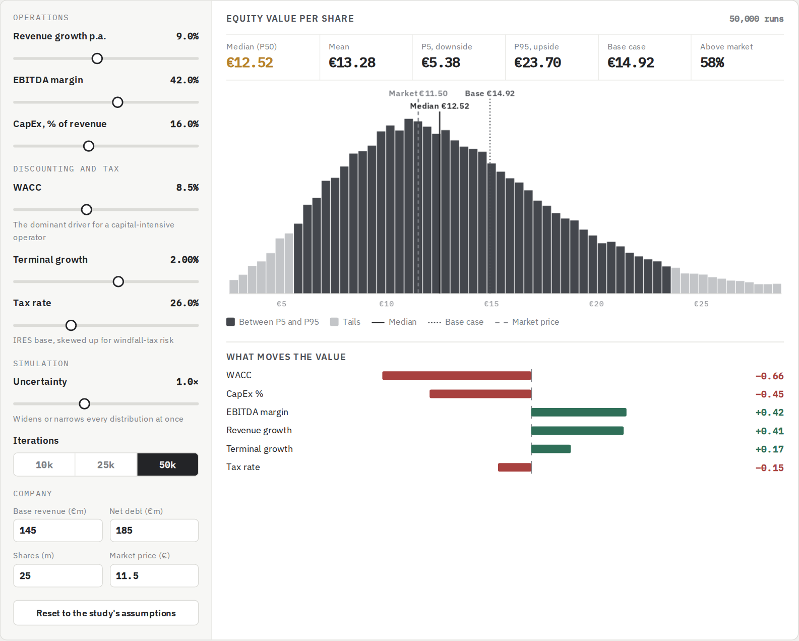

# Monte Carlo DCF Valuation: Lumina Renewables

**Author:** Alessandro Radice · M.Sc. Economics and Business Law (Finance), Università Cattolica del Sacro Cuore, Milan

**What is it worth, and how likely is each value?**
A probabilistic DCF of Lumina Renewables S.p.A., a fictional mid-market Italian solar and wind operator. Instead of a single share price, the model treats six assumptions as probability distributions, re-runs the valuation 50,000 times and reports the full distribution of equity value per share. It comes with an **Excel model with live formulas**, an **investment memo**, a **presentation deck** and an **interactive simulator** that runs in the browser.

**▶ [Open the live simulator](https://alessandroradice.github.io/Monte-Carlo-dcf-valuation/)**

---

## Objective

A standard DCF prints one number, built on assumptions that are really educated guesses. For a capital-intensive business exposed to energy taxation, that number hides most of the risk.

This project has three goals:

1. **Replace point estimates with distributions.** Six drivers are sampled from triangular and normal distributions, with revenue growth and EBITDA margin correlated through a Gaussian copula.
2. **Show what drives the uncertainty.** Rank the inputs by their effect on value and explain why the deterministic base case overstates the typical outcome.
3. **Deliver it in three formats.** An auditable Excel workbook, a written memo for a non-technical reader and a live simulator where anyone can move an assumption and watch the distribution redraw.

---

## Key results (50,000 iterations)

| | Value per share |
|---|---|
| Deterministic base case | €14.92 |
| Simulated median (P50) | €12.46 |
| Downside (P5) / Upside (P95) | €5.35 / €23.63 |
| Market price | €11.50 |
| Probability value > market | 57% |

**The finding:** the base case sits 19.7% above the simulated median. Each distribution has its tail running against value (tax up to 35%, CapEx up to 22%, margin down to 36%), so the most-likely inputs do not produce the typical outcome. WACC is the largest single driver of the spread (rank correlation −0.63), followed by CapEx and EBITDA margin.

---

## What's in the repository

| File | What it is |
|---|---|
| `Lumina_MonteCarlo.xlsx` | Excel model: Assumptions · DCF Base Case · Simulation · Results · Sensitivity · Price Paths |
| `Lumina_MonteCarlo_Memo.pdf` | Investment memo: a plain-language walk-through of the method, the distribution, the risk attribution and the limits |
| `Lumina_MonteCarlo_Deck.pdf` | Five-slide presentation of the case and the findings |
| `index.html` | Live simulator: sliders for every assumption, 2k / 10k / 25k runs, live sensitivity and simulated share-price paths |
| `*.png` | Charts used in this README |

### The Excel model
- **DCF Base Case:** five-year unlevered DCF, fully editable. Revenue, EBITDA, NOPAT, CapEx, ΔNWC, unlevered free cash flow, terminal value and equity value per share.
- **Simulation:** 2,000 live iterations. Each row holds one draw of the six drivers, and every valuation step is a formula linked to the base-case parameters, so changing net debt, share count or D&A reprices all 2,000 runs.
- **Results:** mean, median, percentiles, probabilities and a histogram of value per share.
- **Sensitivity:** correlation of each input with value per share.
- **Price Paths:** Geometric Brownian Motion simulation of the share price over five years.

### The live simulator
Drag any assumption, widen the uncertainty or change the number of runs, and the histogram, percentiles and sensitivity bars update instantly. A second panel simulates five-year share-price paths for a chosen drift and volatility. It is a single HTML file with no dependencies.

---

## Methodology

| Driver | Distribution | Parameters |
|---|---|---|
| Revenue growth (p.a.) | Triangular | 4% / 9% / 14% |
| EBITDA margin | Triangular | 36% / 42% / 46% |
| WACC | Normal | 8.5% ± 1.1% |
| Tax rate | Triangular | 24% / 26% / 35% (windfall-tax risk) |
| Terminal growth | Triangular | 1.0% / 2.0% / 2.75% |
| CapEx (% of revenue) | Triangular | 12% / 16% / 22% |

- **Fixed parameters:** base revenue €145m, D&A 13% of revenue, ΔNWC 3% of incremental revenue, net debt €185m, 25.0m shares.
- **Correlation:** revenue growth and EBITDA margin at +0.35 through a Gaussian copula, so good years arrive with good margins.
- **Guardrail:** a minimum 1.5% spread between WACC and terminal growth prevents extreme draws from producing an infinite terminal value.
- **Price paths:** GBM with monthly steps, 7% drift and 38% volatility, starting from the €11.50 market price. Kept separate from the DCF: one values the company today, the other shows how the price might travel.

## Limitations

- Lumina Renewables is fictional and the input ranges are illustrative judgement, not market data.
- The model prices only the risks it defines; regulatory shocks or demand collapse outside the ranges are not captured.
- Low-WACC draws inflate terminal value disproportionately; the guardrail limits this effect but does not remove it.
- The Excel workbook reproduces 2,000 of the 50,000 iterations, so its statistics differ slightly from the headline figures.

This project is for educational purposes and is not investment advice.

---

## How to use it

1. Download `Lumina_MonteCarlo.xlsx` and open it in Microsoft Excel or Google Sheets. Change the inputs on **DCF Base Case** and every iteration recalculates.
2. Read `Lumina_MonteCarlo_Memo.pdf` for the full explanation.
3. Open the live simulator from the link at the top of this page.

## Tools

`Excel` · `Monte Carlo simulation` · `DCF` · `HTML` · `JavaScript`
