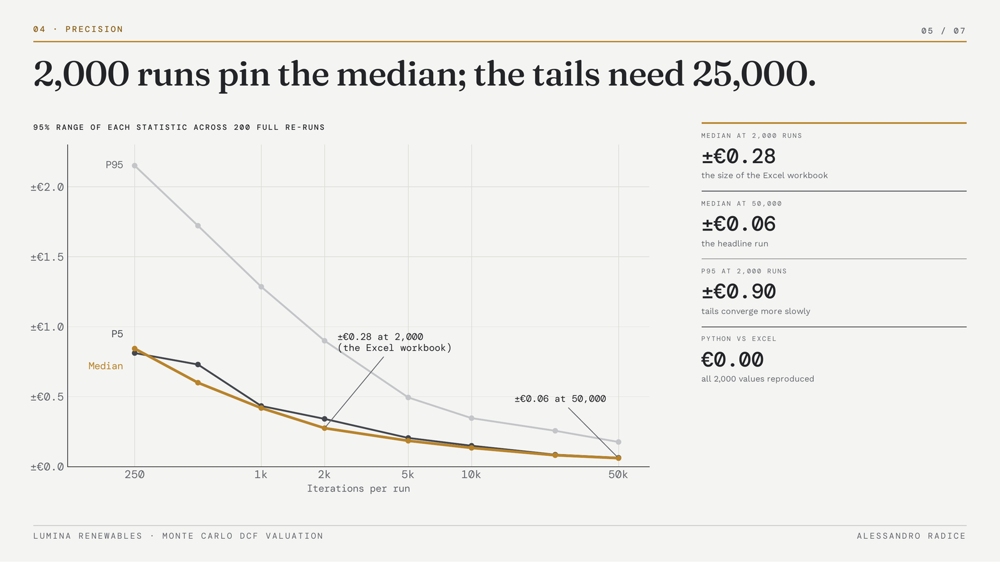
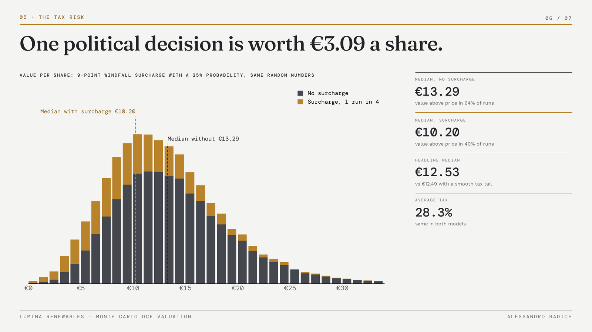

# Monte Carlo DCF Valuation: Lumina Renewables

**Author:** Alessandro Radice · M.Sc. Economics and Business Law (Finance), Università Cattolica del Sacro Cuore, Milan

**What is it worth, and how likely is each value?**
A probabilistic DCF of Lumina Renewables S.p.A., a fictional mid-market Italian solar and wind operator. Instead of a single share price, the model treats six assumptions as probability distributions, re-runs the valuation 50,000 times and reports the full distribution of equity value per share. It comes with a **Python notebook** that produces every number, an **Excel model with 2,000 live iterations** reconciled to Python, an **investment memo**, a **presentation deck** and an **interactive simulator** that runs in the browser.

**▶ [Open the live simulator](https://alessandroradice.github.io/Monte-Carlo-dcf-valuation/)**

---

## Objective

A standard DCF prints one number, built on assumptions that are really educated guesses. For a capital-intensive business exposed to energy taxation, that number hides most of the risk.

This project has four goals:

1. **Replace point estimates with distributions.** Six drivers are sampled from triangular and normal distributions, with revenue growth and EBITDA margin correlated through a Gaussian copula.
2. **Show what drives the uncertainty.** Explain why the deterministic base case overstates the typical outcome and rank the inputs by their effect on value.
3. **Test the answer.** Measure how precise the simulation itself is, and model the windfall-tax risk as an event instead of a tail.
4. **Deliver it in every format.** A reproducible notebook, an auditable Excel workbook, a written memo, a deck and a live simulator.

---

## Key results (50,000 iterations)

| | Value per share |
|---|---|
| Deterministic base case | €14.92 |
| Simulated median (P50) | €12.49 |
| Downside (P5) / Upside (P95) | €5.35 / €23.61 |
| Market price | €11.50 |
| Probability value > market | 57.5% |

**The finding:** the base case sits 19.5% above the simulated median. Most distributions have their tail running against value (tax up to 35%, CapEx up to 22%, margin down to 36%), so the most-likely inputs do not produce the typical outcome. WACC is the largest single driver of the spread (38% of the variance, rank correlation −0.63), followed by CapEx and EBITDA margin.

---

## Two checks on the answer

**How many iterations are enough?** The whole simulation was re-run 200 times with fresh random numbers at each size. The table gives the 95% range of each statistic across re-runs. The error halves when the iterations quadruple, and the tails converge more slowly than the centre: 2,000 iterations are enough for the median, not for P95.

| Iterations | Median | P5 | P95 |
|---|---|---|---|
| 1,000 | ±€0.42 | ±€0.43 | ±€1.29 |
| 2,000 (Excel) | ±€0.28 | ±€0.34 | ±€0.90 |
| 10,000 | ±€0.13 | ±€0.15 | ±€0.35 |
| 50,000 | ±€0.06 | ±€0.06 | ±€0.18 |

**The windfall tax as an event.** The base model gives the tax rate a long tail up to 35%. The event model keeps an ordinary 24% to 28% rate and adds a 9-point surcharge with a 25% probability, so the average tax is the same (28.3%). On the same random numbers the headline barely moves (median €12.53), but the outcome splits in two: a median of **€13.29** without the surcharge and **€10.20** with it. About **€3.09 a share** rides on one political decision.

---

## What's in the repository

| File | What it is |
|---|---|
| `Lumina_MonteCarlo_Analysis.ipynb` | Python notebook: the engine, the 50,000-iteration run, the base-to-median bridge, sensitivity, convergence, the windfall event, price paths and the reconciliation with Excel |
| `Lumina_MonteCarlo.xlsx` | Excel model: Cover · Assumptions · DCF Base Case · Random Draws · Simulation · Results · Sensitivity · Windfall · Convergence · Price Paths · Checks |
| `Lumina_MonteCarlo_Memo.pdf` | Three-page investment memo: the distribution, why the base case flatters, what moves value, precision and the windfall event |
| `Lumina_MonteCarlo_Deck.pdf` | Seven-slide presentation of the case and the findings |
| `index.html` | Live simulator: sliders for every assumption, 10k / 25k / 50k runs, live sensitivity and simulated share-price paths |
| `*.png` | Images used in this README |

### The Python notebook
One engine produces every number in the project. With a fixed seed (113) the 50,000-iteration results are reproducible to the cent. The last section opens the workbook, recomputes each of its 2,000 live iterations from the same random numbers and compares: the largest gap is below €0.000000001.

### The Excel model
- **Assumptions:** every distribution, fixed parameter and windfall setting is a blue input.
- **Simulation:** 2,000 live iterations. Each row turns stored random numbers (`Random Draws`, the first 2,000 of the Python run) into the six drivers through the distributions on `Assumptions`, then values the company with the base-case formulas. Change any assumption and all 2,000 iterations reprice.
- **Results and Sensitivity:** mean, median, percentiles, probabilities, histogram and correlations.
- **Windfall:** the same iterations with the tax modelled as an event; medians with and without the surcharge, next to the 50,000-draw Python gap.
- **Convergence:** the 200-re-run study with the 95% half-width of the median (1.96 × st. dev.), and whether the workbook's own median sits inside the expected range.
- **Price Paths:** Geometric Brownian Motion simulation of the share price over five years.
- **Checks:** Python against Excel, row by row.

### The live simulator
Drag any assumption, widen the uncertainty or change the number of runs, and the histogram, percentiles and sensitivity bars update instantly. A second panel simulates five-year share-price paths for a chosen drift and volatility. It is a single HTML file with no dependencies.

---

## Methodology

| Driver | Distribution | Parameters |
|---|---|---|
| Revenue growth (p.a.) | Triangular | 4% / 9% / 14% |
| EBITDA margin | Triangular | 36% / 42% / 46% |
| WACC | Normal | 8.5% ± 1.1%, clipped to 5.5% and 12.5% |
| Tax rate | Triangular | 24% / 26% / 35% (windfall-tax risk) |
| Terminal growth | Triangular | 1.0% / 2.0% / 2.75% |
| CapEx (% of revenue) | Triangular | 12% / 16% / 22% |

- **Fixed parameters:** base revenue €145m, D&A 13% of revenue, change in NWC 3% of incremental revenue, net debt €185m, 25.0m shares.
- **Correlation:** revenue growth and EBITDA margin at +0.35 through a Gaussian copula, so good years arrive with good margins.
- **Guardrail:** a minimum 1.5% spread between WACC and terminal growth prevents extreme draws from producing an infinite terminal value.
- **Windfall event:** ordinary tax triangular 24% / 26% / 28%, plus 9 points with probability 25%.
- **Price paths:** GBM with monthly steps, 7% drift and 38% volatility, starting from the €11.50 market price. Kept separate from the DCF: one values the company today, the other shows how the price might travel.

## Limitations

- Lumina Renewables is fictional and the input ranges are illustrative judgement, not market data.
- The model prices only the risks it defines; regulatory shocks or demand collapse outside the ranges are not captured.
- Low-WACC draws inflate terminal value disproportionately; the guardrail limits this effect but does not remove it.
- The Excel workbook holds 2,000 of the 50,000 iterations, so its statistics differ slightly from the headline figures (see Convergence).

This project is for educational purposes and is not investment advice.

---

## How to use it

1. Open `Lumina_MonteCarlo_Analysis.ipynb` to see every step, or run it with `pip install numpy scipy pandas matplotlib openpyxl`.
2. Download `Lumina_MonteCarlo.xlsx` and change the blue inputs on **Assumptions**: every iteration recalculates.
3. Read `Lumina_MonteCarlo_Memo.pdf` for the full explanation.
4. Open the live simulator from the link at the top of this page.

## Tools

`Python` · `NumPy` · `Excel` · `Monte Carlo simulation` · `DCF` · `HTML` · `JavaScript`
